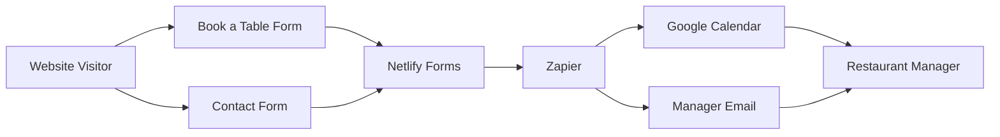
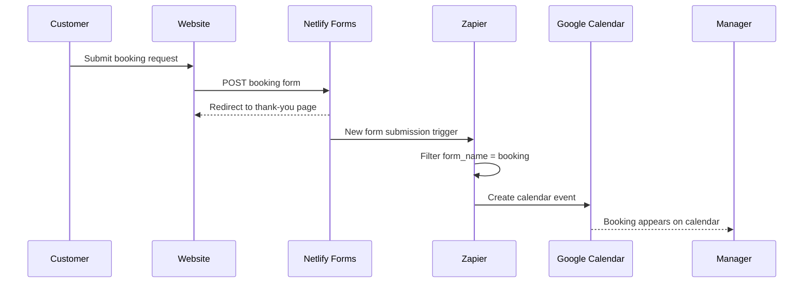
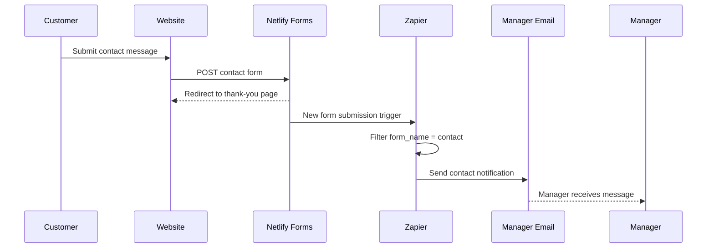
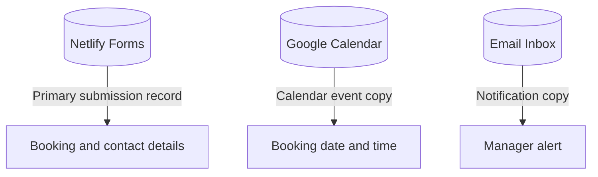
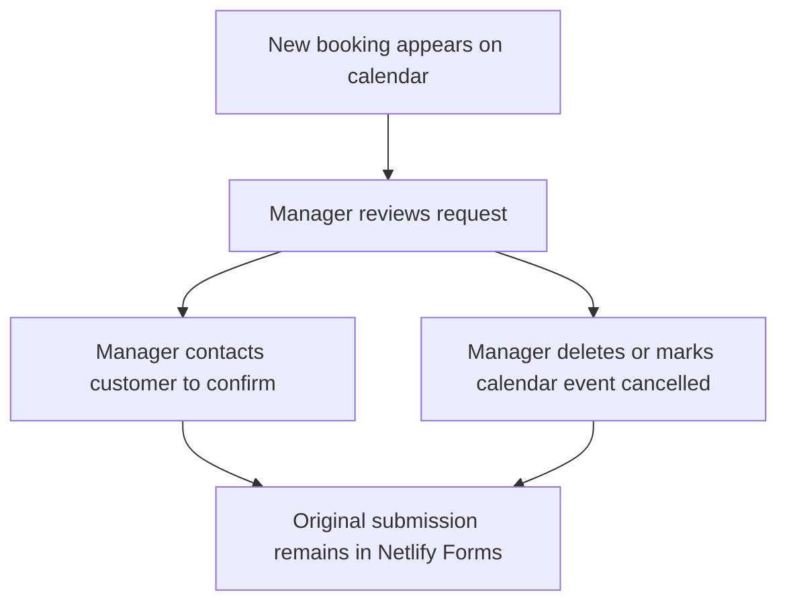

# Zapier Booking and Contact Architecture

This document describes the low-cost workflow for moving website booking and contact submissions into manager tools without building a custom reservation backend.

## System Overview

## Booking Flow

## Contact Flow

## Data Storage

Netlify remains the primary submission record. Zapier does not become the database; it copies submission data into Google Calendar and email.

## Booking Form Fields

The `booking` form currently provides these fields to Zapier:

| Field | Purpose |
| --- | --- |
| `name` | Customer name |
| `email` | Customer email |
| `phone` | Customer phone number |
| `guests` | Party size |
| `date` | Requested reservation date |
| `time` | Requested reservation time |
| `requests` | Special requests or notes |

## Contact Form Fields

The `contact` form currently provides these fields to Zapier:

| Field | Purpose |
| --- | --- |
| `first-name` | Sender first name |
| `last-name` | Sender last name |
| `email` | Sender email |
| `subject` | Message subject |
| `message` | Message body |

## Recommended Zaps

### Zap 1: Booking to Google Calendar

Trigger:

- App: Netlify
- Event: New Form Submission
- Site: Cache 42 site

Filter:

- Continue only if the form name is `booking`.

Action:

- App: Google Calendar
- Event: Create Detailed Event

Suggested event mapping:

| Google Calendar Field | Value |
| --- | --- |
| Calendar | Manager reservation calendar |
| Summary | `Booking - {{name}} - {{guests}}` |
| Start date/time | `{{date}} {{time}}` |
| End date/time | `{{date}} {{time}} + 90 minutes` |
| Description | Customer name, phone, email, guests, date, time, and requests |

### Zap 2: Booking to Manager Email

Trigger:

- App: Netlify
- Event: New Form Submission

Filter:

- Continue only if the form name is `booking`.

Action:

- App: Gmail or Email by Zapier
- Event: Send Email

Suggested email:

- Subject: `New Booking Request: {{name}}`
- Body: Include phone, email, guests, date, time, and requests.

### Zap 3: Contact to Manager Email

Trigger:

- App: Netlify
- Event: New Form Submission

Filter:

- Continue only if the form name is `contact`.

Action:

- App: Gmail or Email by Zapier
- Event: Send Email

Suggested email:

- Subject: `New Contact Message: {{subject}}`
- Body: Include first name, last name, email, subject, and message.

## Manager Workflow

Managers should treat calendar events as booking requests until they contact the customer and confirm availability.

## Limitations

- This does not prevent double bookings automatically.
- This does not assign tables.
- This does not let customers cancel from the website.
- Calendar cancellation is manual: the manager deletes or edits the Google Calendar event.
- Netlify still keeps the original submission unless the manager deletes it from Netlify.

## Upgrade Path

If the restaurant outgrows this workflow:

1. Add Google Sheets as a tracking layer for booking status.
2. Add a second Zap that updates rows when bookings are confirmed or cancelled.
3. Move from request-based booking to real availability logic with Supabase or a reservation platform.
